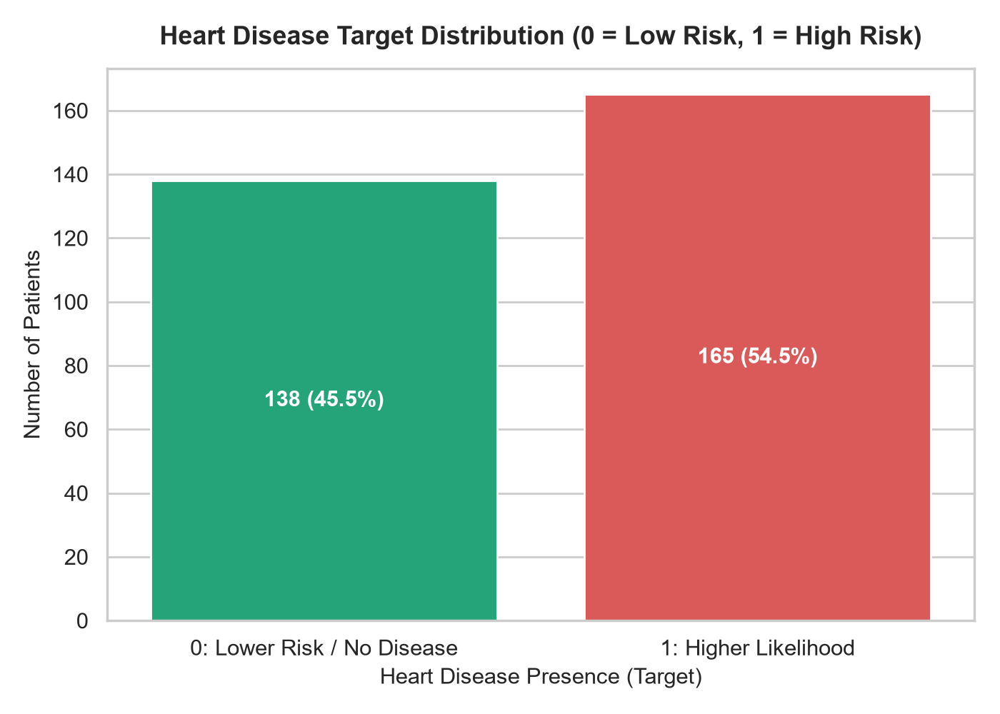
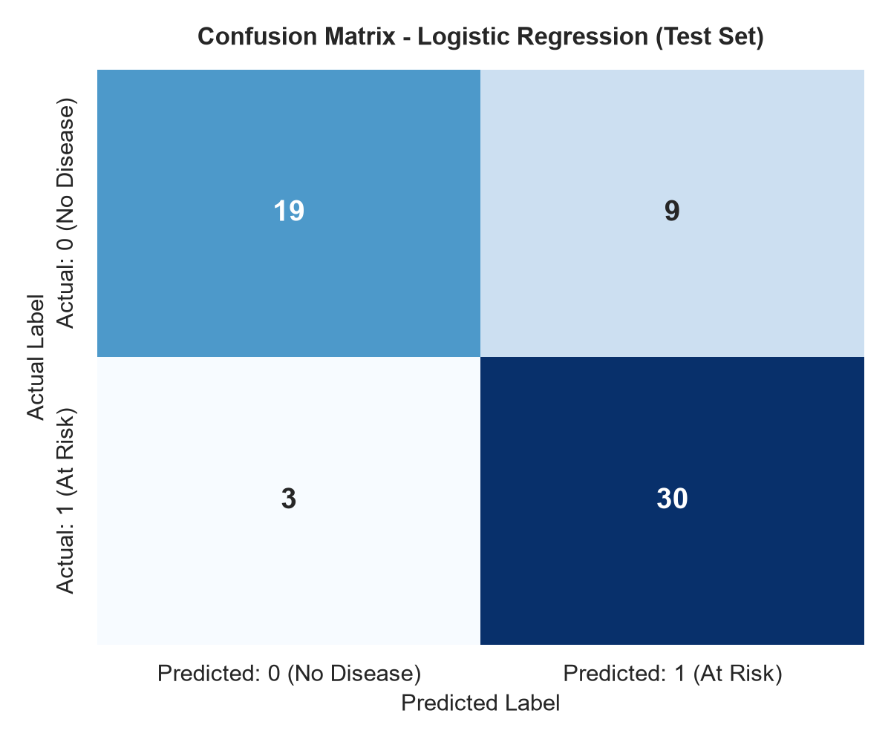
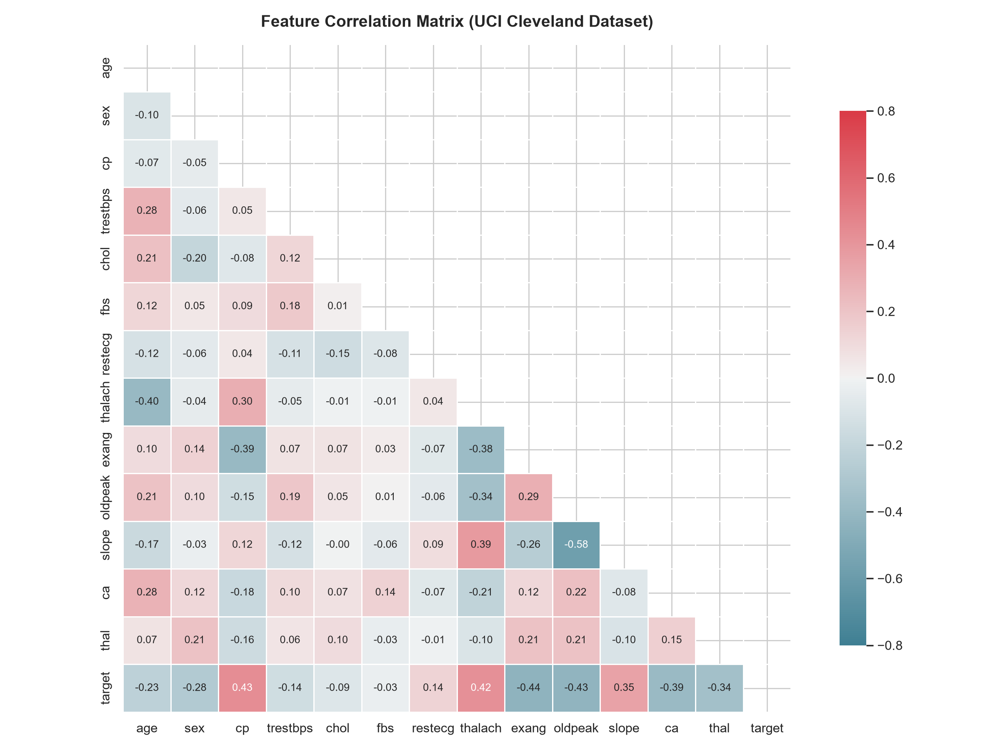

# Heart Disease Prediction System

A beginner-friendly, end-to-end Machine Learning web application that predicts cardiac disease risk likelihood based on 13 standardized medical features. Designed as a college academic and placement resume project, complete with clean code, zero data leakage, exploratory data analysis, and a responsive web interface.

> **⚠️ Educational Disclaimer:**  
> This project is developed **strictly for academic, demonstration, and educational purposes**. It is **NOT a medical diagnostic system** and must never replace clinical assessment, diagnostic testing, or guidance from a licensed physician or cardiologist.

---

## Table of Contents
- [Overview](#overview)
- [Features](#features)
- [Technologies Used](#technologies-used)
- [Machine Learning Approach](#machine-learning-approach)
- [Project Architecture](#project-architecture)
- [Project Structure](#project-structure)
- [Installation](#installation)
- [Running the Project](#running-the-project)
- [Model Evaluation](#model-evaluation)
- [Screenshots](#screenshots)
- [Dataset Source](#dataset-source)
- [Resume Description](#resume-description)
- [Future Improvements](#future-improvements)
- [Disclaimer](#disclaimer)

---

## Overview

Cardiovascular disease is among the leading causes of global mortality. Early identification of individuals with elevated risk patterns allows timely lifestyle interventions and specialist consultations.

This project implements a complete machine learning classification workflow:
1. Ingests the benchmark **UCI Cleveland Heart Disease dataset** (303 records, 14 attributes).
2. Cleans and explores clinical attributes with statistical visualizations (Matplotlib & Seaborn).
3. Preprocesses data with a strict anti-leakage strategy (`StandardScaler` fitted solely on training splits).
4. Trains a primary **Logistic Regression** classifier (alongside an optional **Random Forest** benchmark).
5. Serves predictions in real time via a lightweight, clean **Flask** web application.

---

## Features

- **Accurate Risk Classification**: Predicts whether a patient profile exhibits lower likelihood (Class 0) or higher likelihood (Class 1) of heart disease.
- **Strict Anti-Leakage Pipeline**: `StandardScaler` is fitted strictly on `X_train` to prevent train-test data leakage.
- **Model Comparison**: Implements Logistic Regression as the primary explainable baseline and benchmarks it against Random Forest.
- **Clean, Responsive Web UI**: Card-based interface built with HTML5, modern CSS3, and vanilla JavaScript without bulky frameworks.
- **Demonstration Quick-Fill Presets**: Includes one-click *"Load Sample Low-Risk Profile"* and *"Load Sample Higher-Risk Profile"* buttons for effortless demonstration during placement interviews and viva exams.
- **Algorithmic Probability Output**: Computes sigmoid-based class probability percentages rather than opaque binary flags.
- **Contributing Clinical Insights**: Identifies and explains key elevated markers present in user inputs (e.g., stage 2 hypertension, cholesterol > 240 mg/dl, exercise angina).
- **Comprehensive Documentation**: Includes EDA visualizations, a Jupyter notebook walkthrough, and an interview preparation guide (`INTERVIEW_QA.md`).

---

## Technologies Used

- **Python 3**: Core programming language.
- **Flask**: Lightweight Python web framework for backend routing and template rendering.
- **Pandas**: Tabular data manipulation, inspection, and missing value checks.
- **NumPy**: Numerical vector operations and multi-dimensional arrays.
- **Scikit-learn**: Data splitting, feature standardization (`StandardScaler`), model training (`LogisticRegression`, `RandomForestClassifier`), and metric evaluation.
- **Matplotlib & Seaborn**: Statistical plotting (target distribution, correlation matrix heatmap, confusion matrix).
- **HTML5 & CSS3**: Responsive, semantic frontend styling.
- **JavaScript (Vanilla)**: Client-side input validation and demo profile injection.
- **Joblib**: Efficient serialization of trained model, scaler, and feature metadata.

---

## Machine Learning Approach

### 1. Dataset Inspection
The dataset contains 303 rows and 14 columns with zero missing values. The target variable is binary:
- `0`: No heart disease / lower cardiovascular risk (138 patients, 45.5%).
- `1`: Presence of heart disease / higher cardiovascular risk (165 patients, 54.5%).

### 2. Feature Definitions
The model ingests 13 clinical predictors:
1. `age`: Age in years (29–77)
2. `sex`: Biological sex (1 = Male, 0 = Female)
3. `cp`: Chest pain type (0: Typical angina, 1: Atypical angina, 2: Non-anginal, 3: Asymptomatic)
4. `trestbps`: Resting blood pressure in mm Hg (94–200)
5. `chol`: Serum cholesterol in mg/dl (126–564)
6. `fbs`: Fasting blood sugar > 120 mg/dl (1 = True, 0 = False)
7. `restecg`: Resting electrocardiographic results (0 = Normal, 1 = ST-T wave abnormality, 2 = LV hypertrophy)
8. `thalach`: Maximum heart rate achieved (71–202 bpm)
9. `exang`: Exercise-induced angina (1 = Yes, 0 = No)
10. `oldpeak`: ST depression induced by exercise relative to rest (0.0–6.2)
11. `slope`: Slope of peak exercise ST segment (0 = Upsloping, 1 = Flat, 2 = Downsloping)
12. `ca`: Major vessels colored by fluoroscopy (0–3)
13. `thal`: Thalassemia stress test result (1 = Fixed defect, 2 = Normal flow, 3 = Reversible defect)

### 3. Stratified Train/Test Split
The dataset is partitioned into 80% training data (242 samples) and 20% holdout testing data (61 samples) using `stratify=y` with `random_state=42`.

### 4. Data Preprocessing & Anti-Leakage Scaling
To guarantee that testing and deployment data remain truly unseen:
```python
scaler = StandardScaler()
X_train_scaled = scaler.fit_transform(X_train)  # Learn mean & std from train set ONLY
X_test_scaled = scaler.transform(X_test)        # Transform test set using train stats
```

### 5. Model Selection
- **Logistic Regression (Primary Model)**:
  Chosen for its high interpretability, linear decision boundary, and probabilistic confidence estimation. Fits a sigmoid curve \(P(y=1|\mathbf{x}) = \frac{1}{1 + e^{-\mathbf{w}^T\mathbf{x}}}\).
- **Random Forest (Comparison Model)**:
  Ensemble of 100 decision trees to benchmark non-linear feature interactions.

---

## Project Architecture

```
User (Browser)
   │
   ▼
Frontend Interface (HTML5 / CSS3 / JavaScript)
   │  [POST form data]
   ▼
Flask Backend (app.py)
   │  [Extract & validate 13 clinical inputs]
   ▼
Preprocessing Pipeline
   │  [Apply saved StandardScaler.transform()]
   ▼
Trained Logistic Regression Model (heart_disease_model.pkl)
   │  [Compute decision boundary & predict_proba()]
   ▼
Risk Classification & Factor Analysis
   │  [Render outcome, probability meter & risk markers]
   ▼
Result Page (result.html)
```

---

## Project Structure

```
heart-disease-prediction/
│
├── app.py                     # Flask application & routing
├── train_model.py             # ML pipeline: loading, scaling, training & evaluation
├── requirements.txt           # Clean dependencies for Python 3.11
├── README.md                  # Complete GitHub documentation
├── INTERVIEW_QA.md            # 28 technical interview questions & answers
├── .gitignore                 # Excludes .venv, cache, and system files
│
├── data/
│   └── heart_disease.csv      # UCI Cleveland Heart Disease Dataset (303 records)
│
├── model/
│   └── heart_disease_model.pkl# Serialized model, scaler, feature names & metrics
│
├── templates/
│   ├── base.html              # Base Jinja2 layout with navigation & footer disclaimer
│   ├── index.html             # Landing page with workflow & project highlights
│   ├── predict.html           # Prediction form with demo quick-fill buttons
│   ├── result.html            # Prediction result, probability meter & risk markers
│   └── about.html             # Model architecture, dataset documentation & metrics
│
├── static/
│   ├── css/
│   │   └── style.css          # Clean, modern, responsive styling
│   ├── js/
│   │   └── script.js          # Form validation & quick-fill demo scripts
│   └── images/
│       ├── correlation_matrix.png   # Generated feature correlation heatmap
│       ├── confusion_matrix.png     # Generated test set confusion matrix
│       └── target_distribution.png  # Generated class balance plot
│
└── notebooks/
    └── analysis.ipynb         # Step-by-step EDA & modeling Jupyter notebook
```

---

## Installation

### Prerequisites
- Python 3.10 or Python 3.11 installed.
- Git installed on your system.

### Step-by-Step Setup

1. **Clone the repository:**
   ```bash
   git clone https://github.com/your-username/heart-disease-prediction.git
   cd heart-disease-prediction
   ```

2. **Create a virtual environment:**
   - On Windows:
     ```powershell
     python -m venv .venv
     .venv\Scripts\activate
     ```
   - On macOS/Linux:
     ```bash
     python3 -m venv .venv
     source .venv/bin/activate
     ```

3. **Install dependencies:**
   ```bash
   pip install -r requirements.txt
   ```

---

## Running the Project

1. **Train the Model & Generate Artifacts:**
   Run the training script to evaluate the models, generate evaluation plots, and save `heart_disease_model.pkl`:
   ```bash
   python train_model.py
   ```
   *(This step takes only a few seconds and saves the plots into `static/images/` and the model into `model/`)*.

2. **Start the Flask Web Server:**
   ```bash
   python app.py
   ```

3. **Open the Web Application:**
   Open your browser and navigate to:
   ```
   http://127.0.0.1:5000
   ```

---

## Model Evaluation

The models were evaluated on an unseen test set (20% holdout, 61 samples) using stratified sampling. Below are the **actual mathematical metrics** generated by the pipeline:

| Metric | Logistic Regression (Primary) | Random Forest (Comparison) |
| :--- | :---: | :---: |
| **Accuracy** | **80.33%** | 83.61% |
| **Precision** | **76.92%** | 78.05% |
| **Recall (Sensitivity)** | **90.91%** | 96.97% |
| **F1-Score** | **83.33%** | 86.49% |

### Confusion Matrix (Logistic Regression Test Set: 61 Samples)

| | Predicted: Class 0 (Low Risk) | Predicted: Class 1 (At Risk) |
| :--- | :---: | :---: |
| **Actual: Class 0 (No Disease)** | **19** (True Negative) | **9** (False Positive) |
| **Actual: Class 1 (Disease Present)** | **3** (False Negative) | **30** (True Positive) |

> **Key Takeaway for Technical Interviews:**  
> In medical screening, **Recall is the most critical metric** because False Negatives (telling an at-risk person they are healthy) carry higher risk than False Positives (requesting a healthy person undergo further routine testing). The primary Logistic Regression model achieves **90.91% recall**, missing only 3 out of 33 positive cases in the test set.

---

## Screenshots

<!-- Add actual screenshots after deploying or running locally -->

### 1. Home Page

*Landing page explaining the system, workflow, and non-diagnostic disclaimers.*

### 2. Clinical Prediction Form
*Interactive form with tooltips, validation, and sample profile quick-fill buttons.*

### 3. Prediction Result

*Outcome card showing model-predicted risk likelihood, probability percentage, and risk factors.*

### 4. Model & EDA Documentation

*Full evaluation report displaying the correlation matrix, feature glossary, and performance table.*

---

## Dataset Source

- **Name:** Heart Disease Dataset (Cleveland Clinic Foundation database)
- **Original Source:** [UCI Machine Learning Repository: Heart Disease](https://archive.ics.uci.edu/ml/datasets/heart+disease)
- **Principal Investigators:**
  - Robert Detrano, M.D., Ph.D. (V.A. Medical Center, Long Beach and Cleveland Clinic Foundation)
  - David W. Aha, Ph.D. (UCI Repository curator)
- **Data Attributes:** 13 clinical attributes and 1 binary diagnostic target indicator.

---

## Resume Description

Copy-paste ready bullet points for campus placements and technical resumes:

**Heart Disease Prediction System | Python, Flask, Scikit-learn, Pandas, NumPy**
- Developed an end-to-end machine learning web application using Flask and Scikit-learn to predict heart disease risk based on 13 clinical attributes from the UCI Cleveland dataset.
- Engineered an anti-leakage preprocessing pipeline with stratified train-test splitting and `StandardScaler` fitted strictly on training data, achieving 80.33% accuracy and 90.91% recall with Logistic Regression.
- Benchmarked Logistic Regression against a Random Forest classifier (83.61% accuracy, 96.97% recall) to analyze linear vs. ensemble model tradeoffs in medical tabular data.
- Built a responsive, accessible web interface with instant demo profiles, clinical input validation, and real-time probabilistic risk output with clear non-diagnostic educational disclaimers.

---

## Future Improvements

1. **Dataset Expansion**: Incorporate the Hungarian, Swiss, and Long Beach datasets from the full UCI Heart Disease collection to test cross-population generalization.
2. **Explainable AI (XAI)**: Integrate SHAP (SHapley Additive exPlanations) or LIME to provide patient-specific feature attribution waterfall plots.
3. **Hyperparameter Tuning**: Implement `GridSearchCV` or `RandomizedSearchCV` with 5-fold cross-validation to optimize the regularization parameter \(C\).
4. **Containerization & Cloud Deployment**: Package the application into a Docker container and deploy onto cloud platforms such as AWS Lightsail, Render, or GCP Cloud Run.

---

## Disclaimer

This application is strictly an educational software engineering and machine learning project. The predictions produced by this system are based solely on statistical patterns in historical training data and **do not constitute medical diagnosis, advice, or treatment plans**. Always seek the advice of a qualified physician or healthcare professional for any medical concerns.
